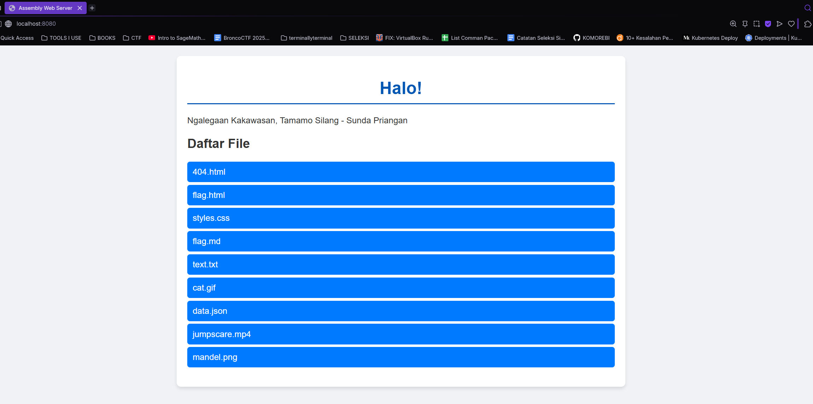

# Ngalegaan Kakawasan, Tamamo Silang - Sunda Priangan
HTTP Server yang ditulis menggunakan x86-64 Assembly, 

## Tabel Spesifikasi
| Spesifikasi          | Sifat | Status |
| -------------------- | ----- | ------ |
| Listening to Port      | Wajib | ✅ |
| Child Process for each Requests   | Wajib | ✅ |
| Parse HTTP Methods    | Wajib | ✅ |
| Serves File           | Wajib | ✅ |
| Routing/Path          | Wajib | ✅ |
| Domain                | Wajib | ✅ |
| Linking Binary                | Bonus | ❌ |
| Port Forwarding                | Bonus | ❌ |
| Backend Framework                | Bonus | ❌ |
| Deploy                | Bonus | ❌ |
| Kreativitas                | Bonus | ❌ |

## Daftar Isi
- [Deskripsi](#deskripsi)
- [Fitur](#fitur)
- [Bonus](#bonus)
- [Refleksi](#refleksi)
- [Referensi](#referensi)

## Deskripsi
Proyek ini adalah sebuah web server sederhana yang ditulis dalam bahasa Assembly x86-64. Server ini mampu menangani beberapa koneksi secara bersamaan menggunakan model forking untuk setiap koneksi dan dapat melayani berbagai jenis file statis serta mendukung metode HTTP dasar seperti GET, POST, PUT, dan DELETE.

- `src` berisikan kode sumber server
- `public` berisikan contoh-contoh file yang dapat dilayani server 

Jenis file yang dapat dilayani:
- HTML
- CSS
- Javascript
- Json
- PNG
- JPG/JPEG
- GIF
- Textfile
- MP4

Jenis file dapat ditambahkan dengan menambah entri MIME pada file `mime.asm`
- Common MIME Types: [Mozilla](https://developer.mozilla.org/en-US/docs/Web/HTTP/Guides/MIME_types/Common_types)

 <br>

> [!tip]
> Jalankan server dengan command `make run`

## Requirements
- NASM
- ld
- GNU Make


## Fitur Utama/Wajib
### 1. Listening to Port
Fitur ini bekerja dengan memanggil syscall `socket`, `bind`, dan `listen`. <br>

**Cara menggunakan** <br>
Cukup jalankan saja server seperti biasa, fitur ini adalah hal pertama yang akan dilakukan server. 

**Cuplikan Kode**
```nasm
    _start:
        ; --- 1. Create Socket ---
        mov rax, SYS_SOCKET
        mov rdi, AF_INET
        mov rsi, SOCK_STREAM
        xor rdx, rdx                       ; default protocol
        syscall

        mov [server_fd], rax               ; save fd

        ; --- Set SO_REUSEADDR Option ---
        mov rax, SYS_SETSOCKOPT
        mov rdi, [server_fd]
        mov rsi, SOL_SOCKET
        mov rdx, SO_REUSEADDR
        lea r10, [reuse_opt]
        mov r8, 4
        syscall
        ; =================================

        ; --- 2. Bind Socket --- 
        mov rax, SYS_BIND
        mov rdi, [server_fd]
        lea rsi, [server_address]
        mov rdx, server_address_len
        syscall

        ; --- 3. Listen for connection  ---
        mov rax, SYS_LISTEN
        mov rdi, [server_fd]
        mov rsi, 10                        ; Connection queue
        syscall

        mov rax, SYS_WRITE
        mov rdi, STDOUT
        lea rsi, [msg_listening]
        mov rdx, len_listening
        syscall
```

### 2. Forking Child untuk setiap Request
Untuk setiap koneksi berbeda dari client, server akan membuat proses baru sehingga server tidak harus berhenti untuk meng-*handle* satu *client*, dan dapat meng-*handle* beberapa *client*. Cara kerjanya dengan sebuah loop yang selalu berjalan pada server sebagai *parent process*. *Parent process* ini akan melakukan `fork` ketika ada *client* yang ingin melakukan koneksi.

**Cara menggunakan** <br>
Jalankan server seperti biasa, lalu buka `localhost:8080` pada browser. Untuk forking, buka lagi `localhost:8080` pada tab baru

**Cuplikan Kode**
```nasm
    accept_loop:
        mov rax, SYS_ACCEPT
        mov rdi, [server_fd]
        xor rsi, rsi
        xor rdx, rdx
        syscall

        mov [client_fd], rax               ; Client FD

        mov rax, SYS_FORK
        syscall

        cmp rax, 0                         ; retval of FORK
        je child_process

        ; --- Parent Process ---
        mov rax, SYS_CLOSE
        mov rdi, [client_fd]
        syscall

        jmp accept_loop
```

### 3. Parsing HTTP Methods
Server dapat melakukan *parsing* pada *request* HTTP untuk mendapatkan metode yang diinginkan *client*. Cara kerjanya hanya dengan membaca bagian awal *request* dan mengambil string hingga spasi pertama.

**Cara menggunakan** <br>
Lakukan *request* dengan curl, bisa menggunakan salah satu dari baris perintah berikut:
```bash
    curl -i http://127.0.0.1:8080
    curl -i -X POST http://127.0.0.1:8080
    curl -i -X PUT http://127.0.0.1:8080
    curl -i -X DELETE http://127.0.0.1:8080
```

**Cuplikan Kode**
```nasm
    child_process:
        ; ... kode awal

        ; --- Read Requests ---
        mov rax, SYS_READ
        mov rdi, [client_fd]
        lea rsi, [client_buffer]
        mov rdx, REQUEST_BUFFER_SIZE
        syscall

        mov r15, rax                       ; read data

        ; --- Parse Method ---
        lea rsi, [client_buffer]
        mov [method_], rsi
        .parse_method_loop:
            cmp byte [rsi], ' '            ; First space
            je .method_found
            inc rsi
            jmp .parse_method_loop

        .method_found:
            mov rdx, rsi
            sub rdx, [method_]
            mov [method_len], rdx

            mov byte [rsi], 0              ; Null terminate method
            inc rsi

        ; ... bagian selanjutnya dari child_process
```

### 4. Melayani Permintaan File dan Routing 
Server ini dapat melayani permintaan file statis dari direktori `./public` melalui method GET. Ketika *cleint* membuka suatu *route*, atau melakukan curl dengan GET pada route tersebut, server akan menggabungkan path dengan prefiks `./public`, lalu membuka dan mengirim file tersebut kepada *client*. <br>
Route awal `/` ditranslasikan menjadi `./public/index.html`, sedangkan route lainnya akan di-*append* pada prefiks `./public`. <br>
Jenis file yang dapat dilayani dijelaskan lebih lanjut pada bagian [kreativitas](#kreativitas)

**Cara Menggunakan**
- Melayani File <br>
Untuk mencoba fitur pelayanan file, cukup buka halaman utama dari alamat server (defaultnya `localhost:8080`). Pada halaman tersebut ada beberapa *button* yang akan membawa ke route-route berbeda sesuai file, cukup tekan salah satu tombol untuk membuka file tersebut. (sebenarnya, berada di halaman utama sudah cukup untuk mencoba fitur ini, tapi *why not explore more?*)
- Routing <br>
Untuk routing, anda bisa mencoba menggunakan method PUT, POST dan DELETE. Lakukan salah satu perintah berikut pada route suatu file yang ada di `./public`
```bash
    curl -i -X POST http://127.0.0.1:8080
    curl -i -X PUT http://127.0.0.1:8080
    curl -i -X DELETE http://127.0.0.1:8080
```

**Cuplikan Kode** <br>
Dibawah adalah kode untuk *handling* method GET. Kode inti dari fitur ini cukup panjang, jika ingin melihatnya ada pada file `server.asm`, pada label `serve_static_file`.
```nasm
    handle_get:
        mov rsi, [path_]
        cmp byte [rsi], '/'
        jne .serve_file

        mov rdx, [path_len]
        cmp rdx, 1
        je .serve_index                    ; Serve index.html if path is '/'

        jmp .serve_file

        .serve_index:
            lea rdi, [path_buffer]
            lea rsi, [path_index]
            mov rcx, 21                    ; Hardcoded length of index path cos im too lazy
            rep movsb                      ; copy string

            lea rdi, [path_buffer]
            call serve_static_file
            jmp client_disconnected

        .serve_file:
        ; appends ./public prefix then call to serve file
            lea rdi, [path_buffer]
            call build_path
            mov byte [rdi], 0

            lea rdi, [path_buffer]
            call serve_static_file
            jmp client_disconnected

        not_found:
            lea rdi, [path_404]
            call serve_404
            jmp client_disconnected
        ret
```
**Screenshot Fitur** <br>
`index.html`



## Fitur Bonus
### Kreativitas
#### Melayani berbagai jenis file
Implementasi ini terdapat pada file `mime.asm`. Server ini dapat melayani 


## Referensi
- Searchable Syscall Table: https://filippo.io/linux-syscall-table
- Linux man-pages: https://man7.org/linux/man-pages