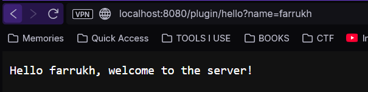
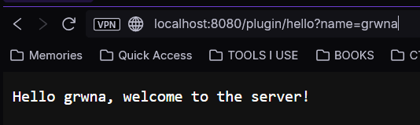
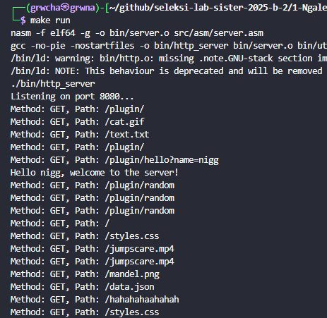

# Ngalegaan Kakawasan, Tamamo Silang - Sunda Priangan
HTTP Server yang ditulis menggunakan x86-64 Assembly, 

## Tabel Spesifikasi
| Spesifikasi          | Sifat | Status |
| -------------------- | ----- | ------ |
| Listening to Port      | Wajib | ✅ |
| Child Process for each Requests   | Wajib | ✅ |
| Parse HTTP Methods    | Wajib | ✅ |
| Serves File           | Wajib | ✅ |
| Routing/Path          | Wajib | ✅ |
| Domain                | Wajib | ✅ |
| Linking Binary                | Bonus | ✅ |
| Port Forwarding                | Bonus | ❌ |
| Backend Framework                | Bonus | ❌ |
| Deploy                | Bonus | ✅ |
| Kreativitas                | Bonus | ✅ |

## Daftar Isi
- [Deskripsi](#deskripsi)
- [Fitur](#fitur-utamawajib)
- [Bonus](#fitur-bonus)
- [Referensi](#referensi)

## Deskripsi
Proyek ini adalah sebuah web server sederhana yang ditulis dalam bahasa Assembly x86-64. Server ini mampu menangani beberapa koneksi secara bersamaan menggunakan model forking untuk setiap koneksi dan dapat melayani berbagai jenis file statis serta mendukung metode HTTP dasar seperti GET, POST, PUT, dan DELETE.

### Struktur program
```shell
    .
    ├── README.md
    ├── makefile        --Skrip untuk menjalankan program
    ├── public          --Berisi file-file yang dapat diakses pengguna
    ├── server.log      --Output dari file logging
    └── src
        ├── asm         --Berisi kode sumber server dalam assembly
        └── other       --Berisi kode sumber selain assembly
```


 <br>

> [!tip]
> Jalankan server dengan command `make run`

## Requirements
- NASM
- ld
- GNU Make


## Fitur Utama/Wajib
### 1. Listening to Port
Fitur ini bekerja dengan memanggil syscall `socket`, `bind`, dan `listen`. <br>

**Cara menggunakan** <br>
Cukup jalankan saja server seperti biasa, fitur ini adalah hal pertama yang akan dilakukan server. 

**Cuplikan Kode**
```nasm
    _start:
        ; --- 1. Create Socket ---
        mov rax, SYS_SOCKET
        mov rdi, AF_INET
        mov rsi, SOCK_STREAM
        xor rdx, rdx                       ; default protocol
        syscall

        mov [server_fd], rax               ; save fd

        ; --- Set SO_REUSEADDR Option ---
        mov rax, SYS_SETSOCKOPT
        mov rdi, [server_fd]
        mov rsi, SOL_SOCKET
        mov rdx, SO_REUSEADDR
        lea r10, [reuse_opt]
        mov r8, 4
        syscall
        ; =================================

        ; --- 2. Bind Socket --- 
        mov rax, SYS_BIND
        mov rdi, [server_fd]
        lea rsi, [server_address]
        mov rdx, server_address_len
        syscall

        ; --- 3. Listen for connection  ---
        mov rax, SYS_LISTEN
        mov rdi, [server_fd]
        mov rsi, 10                        ; Connection queue
        syscall

        mov rax, SYS_WRITE
        mov rdi, STDOUT
        lea rsi, [msg_listening]
        mov rdx, len_listening
        syscall
```

### 2. Forking Child untuk setiap Request
Untuk setiap koneksi berbeda dari client, server akan membuat proses baru sehingga server tidak harus berhenti untuk meng-*handle* satu *client*, dan dapat meng-*handle* beberapa *client*. Cara kerjanya dengan sebuah loop yang selalu berjalan pada server sebagai *parent process*. *Parent process* ini akan melakukan `fork` ketika ada *client* yang ingin melakukan koneksi.

**Cara menggunakan** <br>
Jalankan server seperti biasa, lalu buka `localhost:8080` pada browser. Untuk forking, buka lagi `localhost:8080` pada tab baru

**Cuplikan Kode**
```nasm
    accept_loop:
        mov rax, SYS_ACCEPT
        mov rdi, [server_fd]
        xor rsi, rsi
        xor rdx, rdx
        syscall

        mov [client_fd], rax               ; Client FD

        mov rax, SYS_FORK
        syscall

        cmp rax, 0                         ; retval of FORK
        je child_process

        ; --- Parent Process ---
        mov rax, SYS_CLOSE
        mov rdi, [client_fd]
        syscall

        jmp accept_loop
```

### 3. Parsing HTTP Methods
Server dapat melakukan *parsing* pada *request* HTTP untuk mendapatkan metode yang diinginkan *client*. Cara kerjanya hanya dengan membaca bagian awal *request* dan mengambil string hingga spasi pertama.

**Cara menggunakan** <br>
Lakukan *request* dengan curl, bisa menggunakan salah satu dari baris perintah berikut:
```bash
    curl -i http://127.0.0.1:8080
    curl -i -X POST http://127.0.0.1:8080
    curl -i -X PUT http://127.0.0.1:8080
    curl -i -X DELETE http://127.0.0.1:8080
```

**Cuplikan Kode**
```nasm
    child_process:
        ; ... kode awal

        ; --- Read Requests ---
        mov rax, SYS_READ
        mov rdi, [client_fd]
        lea rsi, [client_buffer]
        mov rdx, REQUEST_BUFFER_SIZE
        syscall

        mov r15, rax                       ; read data

        ; --- Parse Method ---
        lea rsi, [client_buffer]
        mov [method_], rsi
        .parse_method_loop:
            cmp byte [rsi], ' '            ; First space
            je .method_found
            inc rsi
            jmp .parse_method_loop

        .method_found:
            mov rdx, rsi
            sub rdx, [method_]
            mov [method_len], rdx

            mov byte [rsi], 0              ; Null terminate method
            inc rsi

        ; ... bagian selanjutnya dari child_process
```

### 4. Melayani Permintaan File dan Routing 
Server ini dapat melayani permintaan file statis dari direktori `./public` melalui method GET. Ketika *cleint* membuka suatu *route*, atau melakukan curl dengan GET pada route tersebut, server akan menggabungkan path dengan prefiks `./public`, lalu membuka dan mengirim file tersebut kepada *client*. <br>
Route awal `/` ditranslasikan menjadi `./public/index.html`, sedangkan route lainnya akan di-*append* pada prefiks `./public`. <br>
Jenis file yang dapat dilayani dijelaskan lebih lanjut pada bagian [kreativitas](#kreativitas)

**Cara Menggunakan**
- Melayani File <br>
Untuk mencoba fitur pelayanan file, cukup buka halaman utama dari alamat server (defaultnya `localhost:8080`). Pada halaman tersebut ada beberapa *button* yang akan membawa ke route-route berbeda sesuai file, cukup tekan salah satu tombol untuk membuka file tersebut. (sebenarnya, berada di halaman utama sudah cukup untuk mencoba fitur ini, tapi *why not explore more?*)
- Routing <br>
Untuk routing, anda bisa mencoba menggunakan method PUT, POST dan DELETE. Lakukan salah satu perintah berikut pada route suatu file yang ada (untuk PUT dan DELETE) ataupun tidak ada (POST dan PUT) di `./public`. Anda bisa konfirmasi pembuatan/perubahan file dengan membuka route ke file tersebut.
```bash
    curl -i -X POST http://127.0.0.1:8080/<nama_file>
    curl -i -X PUT http://127.0.0.1:8080/<nama_file>
    curl -i -X DELETE http://127.0.0.1:8080/<nama_file>
```

**Cuplikan Kode** <br>
Dibawah adalah kode untuk *handling* method GET. Kode inti dari fitur ini cukup panjang, jika ingin melihatnya ada pada file `server.asm`, pada label `serve_static_file`.
```nasm
    handle_get:
        mov rsi, [path_]
        cmp byte [rsi], '/'
        jne .serve_file

        mov rdx, [path_len]
        cmp rdx, 1
        je .serve_index                    ; Serve index.html if path is '/'

        jmp .serve_file

        .serve_index:
            lea rdi, [path_buffer]
            lea rsi, [path_index]
            mov rcx, 21                    ; Hardcoded length of index path cos im too lazy
            rep movsb                      ; copy string

            lea rdi, [path_buffer]
            call serve_static_file
            jmp client_disconnected

        .serve_file:
        ; appends ./public prefix then call to serve file
            lea rdi, [path_buffer]
            call build_path
            mov byte [rdi], 0

            lea rdi, [path_buffer]
            call serve_static_file
            jmp client_disconnected

        not_found:
            lea rdi, [path_404]
            call serve_404
            jmp client_disconnected
        ret
```
**Screenshot Fitur** <br>
`index.html`
<p align="center">
    
</p>
<p align="center"><em>Menu utama (index.html) pada server, dilayani sebagai file html</em></p>

<br>
<br>

## Fitur Bonus
### Linking Program C
Menggunakan static linking, kode Assembly dan C digabungkan menjadi satu executable. Kode C bertindak sebagai *plugin* bagi server. Plugin ini bekerja untuk route `/plugin/`, di mana jika user mengakses route ini, server akan meneruskan request tersebut ke program C untuk di olah.

**Cara Menggunakan** <br>
Route yang tersedia untuk plugin ini adalah:
- `/plugin/` - menunjukkan *help page* plugin
- `/plugin/random` - men-*generate* sebuah angka random (1-10000)
- `/plugin/hello` - menampilkan pesan sapaan dengan parameter nama

>[!note]
> Pastikan route yang digunakan adalah `/plugin/` bukan `/plugin`

**Cuplikan Kode** <br>
Berikut adalah cuplikan kode Assembly yang memanggil binary yang di-*link*. Untuk melihat implementasi dari pluginnya sendiri dapat melihat kode sumber pada direktori `src/other`
```nasm
    section .data
        plugin_path db '/plugin/', 0

    handle_get:
        push rdi
        push rsi
        push rcx
        push rbp

        ; handle plugin
        mov rdi, [path_]
        mov rsi, plugin_path
        mov rcx, 8

        cld
        repe cmpsb
        je .call_plugin

        pop rbp
        pop rcx
        pop rsi
        pop rdi
    
    .call_plugin:
        mov rdi, [client_fd]
        mov rsi, [method_]
        mov rdx, [path_]
        call handle_plugin_request

        pop rbp
        pop rcx
        pop rsi
        pop rdi

        jmp client_disconnected
```

**Screenshot Fitur** <br>
<p align="center">
    
</p>
<p align="center"><em>/plugin/hello dengan parameter name=farrukh</em></p>

<br>
<p align="center">
    
</p>
<p align="center"><em>/plugin/hello dengan parameter name=grwna</em></p>

<br>

### Deploy
Deployment dapat dibuka pada tautan berikut: [https://grwnasm.eastasia.cloudapp.azure.com](https://grwnasm.eastasia.cloudapp.azure.com)

Deployment dilakukan dengan Microsoft Azure sebagai VPS. Sertifikasi HTTPS didapatkan dan dikelola menggunakan Certbot dari CA Let's Encrypt.
Konfigurasi yang saya gunakan ditampilkan pada Cuplikan Kode

**Cuplikan Kode** <br>
```
    # asm-server.service
    [Unit]
    Description=Assembly Web Server
    After=network.target

    [Service]
    User=grwna
    Group=grwna
    WorkingDirectory=/home/grwna/asm-server             --- Directory proyek di VM
    ExecStart=/home/grwna/asm-server/bin/http_server
    Restart=always

    [Install]
    WantedBy=multi-user.target
```
```
    # asm-nginx.conf
    server {
        listen 80;
        server_name grwnasm.eastasia.cloudapp.azure.com;

        location / {
            proxy_pass http://127.0.0.1:8080;
            proxy_set_header Host $host;
            proxy_set_header X-Real-IP $remote_addr;
        }
    }
```

Skrip otomasi deployment
```
    # deploy.sh
    sudo cp ~/asm-server/deployment/asm-server.service /etc/systemd/system/asm-server.service
    sudo cp ~/asm-server/deployment/asm-nginx.conf /etc/nginx/sites-available/asm-nginx.conf
    sudo systemctl enable asm-server.service
    sudo systemctl start asm-server.service
    sudo systemctl status asm-server.service
    sudo ln -s /etc/nginx/sites-available/asm-nginx.conf /etc/nginx/sites-enabled/
    sudo nginx -t
    sudo systemctl restart nginx
    sudo systemctl status nginx
    sudo certbot --nginx
```

<br>

### [Kreativitas] Sistem Logging Sederhana
Sistem logging pada server ini menampilkan method yang digunakan serta path/route yang diakses oleh client, setiap ada permintaan ke server. Logging akan ditampilkan pada stdout/terminal dan juga disimpan ke file `server.log`.

**Cuplikan Kode** <br>
```nasm
    print_logging:
        ; --- Open the log file for appending ---
        mov rax, SYS_OPEN
        lea rdi, [log_file]
        mov rsi, O_WRONLY | O_CREAT | O_APPEND
        mov rdx, 0644o  ; File permissions (rw-r--r--)
        syscall
        ; rax now holds fd

        test rax, rax
        js .exit_no_close

        mov rbx, rax ; Save the file descriptor

        ; --- Log "Method: " ---
        mov rax, SYS_WRITE
        lea rsi, [msg_method]
        mov rdx, len_msg_method
        mov rdi, STDOUT ; 1. Target stdout
        syscall
        mov rax, SYS_WRITE
        mov rdi, rbx    ; 2. Target the log file
        syscall

        ; --- Log the actual method ---
        mov rax, SYS_WRITE
        mov rsi, [method_]
        mov rdx, [method_len]
        mov rdi, STDOUT
        syscall
        mov rax, SYS_WRITE
        mov rdi, rbx
        syscall

    ...the rest of the code
```

**Screenshot Fitur** <br>
<p align="center">
    
</p>
<p align="center"><em>Output logging pada stdout</em></p>

<br>

### [Kreativitas]  Melayani Berbagai Jenis File
Implementasi ini terdapat pada file `mime.asm`. Server ini dapat melayani berbagai jenis file menggunakan tipe MIME dari file-file tersebut.
- HTML
- CSS
- Javascript
- Json
- PNG
- JPG/JPEG
- GIF
- Textfile
- MP4

Jenis file dapat ditambahkan dengan menambah entri MIME pada file `mime.asm` sesuai yang ada pada sumber berikut:
- Common MIME Types: [Mozilla](https://developer.mozilla.org/en-US/docs/Web/HTTP/Guides/MIME_types/Common_types)

**Cuplikan Kode** <br>
Di bawah ini adalah kode yang menunjukkan definisi dari MIME type file yang didukung, logika dari fitur ini bisa dilihat pada file `src/asm/mime.asm`
```nasm
    section .data
        ; --- Content Types ---
        mime_html   db 'Content-Type: text/html; charset=utf-8', 13, 10
        len_html    equ $ - mime_html

        mime_css    db 'Content-Type: text/css', 13, 10
        len_css     equ $ - mime_css

        mime_js     db 'Content-Type: application/javascript', 13, 10
        len_js      equ $ - mime_js

        mime_json   db 'Content-Type: application/json', 13, 10
        len_json    equ $ - mime_json

        mime_png    db 'Content-Type: image/png', 13, 10
        len_png     equ $ - mime_png

        mime_jpg    db 'Content-Type: image/jpeg', 13, 10
        len_jpg     equ $ - mime_jpg

        mime_gif    db 'Content-Type: image/gif', 13, 10
        len_gif     equ $ - mime_gif

        mime_ico    db 'Content-Type: image/x-icon', 13, 10
        len_ico     equ $ - mime_ico

        mime_txt    db 'Content-Type: text/plain', 13, 10
        len_txt     equ $ - mime_txt

        mime_pdf    db 'Content-Type: application/pdf', 13, 10
        len_pdf     equ $ - mime_pdf
        mime_mp3    db 'Content-Type: audio/mp3', 13, 10
        len_mp3     equ $ - mime_mp3

        mime_mp4    db 'Content-Type: video/mp4', 13, 10
        len_mp4     equ $ - mime_mp4

        mime_md    db 'Content-Type: text/markdown', 13, 10
        len_md      equ $ - mime_md
        
        mime_default db 'Content-Type: application/octet-stream', 13, 10
        len_default equ $ - mime_default
```
**Screenshot Fitur** <br>
<p align="center">
    
</p>
<p align="center"><em>Server melayani file video .mp4</em></p>


## Referensi
- Searchable Syscall Table: https://filippo.io/linux-syscall-table
- Linux man-pages: https://man7.org/linux/man-pages