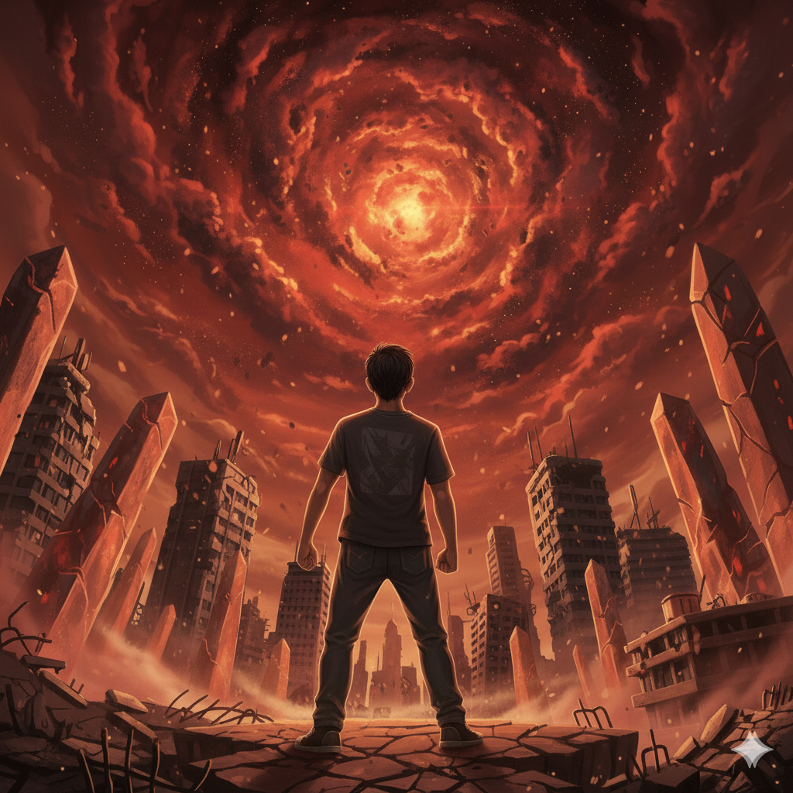

# TTKI - Tulis Tulis Karya Imajinasi

## Tabel Spesifikasi
| Spesifikasi          | Sifat | Status |
| -------------------- | ----- | ------ |
| Cerita Pendek      | Wajib | ✅ |
| Membuat Penulis Cringe       | Wajib | ✅ |
| Membuat Pembaca Tertawa  | Wajib | Pending |
| Integrasi dengan Lore Sister       | Bonus | ❌ |

## The Terror Called S.I.S.T.E.R;
Pada suatu hari, hiduplah seorang Mahasiswa Teknik Informatika bernama Joko. Di masa-masa tenagn seperti ini, Joko sedang bersantai di singgasananya, menyantap Indomie Mi Instan Rasa Ayam Spesial Lengkap Dengan Minyak Bawang yang telah ia masak sebelumnya. Ia Sedang menikmati kedamaian yang sejak lama ia dambakan.

Ia berhak mendapat kedamaian ini setelah melalui semester-semester neraka lalu, dimana ia menaklukkan dan membunuh entitas *pure evil* seperti Iblis Agung Orkom, Dewa Budi OS, dan Monster Fajar Jarkom.

Kedamaian itu, tentu saja, berumur pendek.

Ketika sedang menyeruput kuah mi yang gurih itu, tiba-tiba layar laptopnya berkedip-kedip dengan warna merah darah. Udara di kamarnya terasa panas dingin. Ketika Joko mencoba mengecek apa yang salah dengan laptopnya, tiba-tiba semua menjadi sunyi, dan Joko tidak bisa bergerak.

"Hah, ini kenapa co?" Ujar Joko.

"Ting" muncul suara nada tinggi yang entah dari mana asalnya.

"Ahh suara ap---" sebelum Joko dapat menyelesaikan kalimatnya, ia disedot ke dalam laptopnya.

*This sound plays at this point: https://www.youtube.com/watch?v=0HVrFzuFr5o*

"AAAHHHHHHHHH" teriak Joko.
"OOOOFFF" Joko jatuh dari ketinggian yang lumayan tinggi, namun dia selamat.

Tak lama setelah jatuh, Joko menguatkan dirinya untuk berdiri. Masih menahan rasa sakit, Joko melihat ke sekitarnya, mencoba merasionalkan apa yang baru saja terjadi, dan di mana ia sedang berada. Namun, setelah melihat ke sekitarnya, Joko paham apa yang sedang ia alami.

"Ohhh sh\*t man, wut de hel, not this sh\*t again".

Tempat ini sudah familiar untuk Joko. Bangunan-bangunan yang usang, langit yang jingga abadi, dan rasa panas yang hampir tak tertahankan. Disinilah tempat dimana nyawanya hampir hilang melawan Dewa Budi OS dan Monster Fajar Jarkom.

Di tengah renungannya itu, tiba-tiba terdengar suara keras yang menggetar bumi di sekitarnya.  
*This sound https://www.youtube.com/watch?v=QQPuRzzoGZQ*

Langit jingga yang sedang ditatap Joko tiba-tiba robek, dan memperlihatkan sebuah entitas *pure evil* yang belum pernah ia jumpai sebelumnya. Inilah S.I.S.T.E.R;, *Sentient Interconnected System of Terrifying Error Recursion*. Ia adalah sebuah entitas yang terbuat dari banyak titik-titik kekacauan di angkasa, yang berdenyut dengan niat untuk merobek setiap jalinan keberadaan.

Denyutan S.I.S.T.E.R; menyebabkan gelombang energi yang sangat kuat, menghancurkan realita di sekitarnya. Salah satu dari denyutan itu membuat gelombang energi yang menerjang Joko, melempar tubuhnya jauh ke belakang. Rasa sakit yang mematikan menjalar, seperti jiwanya sedang terkoyak-koyak, dan lama kelamaan kesadarannya memudar.

Di saat Joko terombang-ambing di alam bawah sadar, sebuah bisikan lembut menembus ketidaksadarannya. Dan tiba-tiba, ia berada di sebuah kuil kuno, dan berhadapan dengan bayangan samar wanita berjubah putih.

"Joko, kau takkan bisa menaklukkan makhluk itu sendirian. Ia tak akan dikalahkan oleh serangan tunggal. Setiap kali satu titik dihancurkan, ia akan bangkit kembali seolah-olah tidak terjadi apa-apa" 

"Untuk dapat mengalahkannya, kau harus membangkitkan S.I.S.T.E.R. Hanya dengan menyatukan kembali kepingan-kepingannya lah kau dapat mengalahkan kekacauan itu".

"Hah? jadi w harus ngapain?" ujar Joko.

"Ambil ini, ini adalah petunjuk untuk mu agar dapat mengalakan S.I.S.T.E.R;" wanita itu memberikan *scroll* yang berisi strategi mengalahkan S.I.S.T.E.R;.

Setelah itu, bayangan wanita itu memudar hingga lenyap sepenuhnya. Joko yang masih kebingunan dengan gegas membuka *scroll* yang diberikan. 

"Oh gitu" ujar Joko, yang sekarang memahami apa yang harus ia lakukan.

Joko harus membangun kembali S.I.S.T.E.R, yaitu *Sistem Integrasi Solidaritas Terdistribusi Realitas* (man wtf am i doing). Ia adalah entitas kebaikan yang menjaga keseimbangan di tengah keberadaan S.I.S.T.E.R;. Namun, beberapa waktu lalu S.I.S.T.E.R dihancurkan oleh S.I.S.T.E.R;, yang berniat merusak keseimbangan dan melenyapkan alam semesta.

Sekarang Joko paham. Yang harus ia lakukan adalah meminta pertolongan S.I.S.T.E.R dengan membangunkannya. Dengan ini, ia bersiap untuk menjalankan perjalanan yang akan penuh perjuangan ini.

"Baiklah, kalo itu yang harus w lakukan, sudah saatnya aku rm -rf / makhluk ini" ucap Joko dengan penuh semangat.

    

<em>Sumber: Gambar dibuat menggunakan Google Imagen</em>

## Author's Notes
idk man type sht

